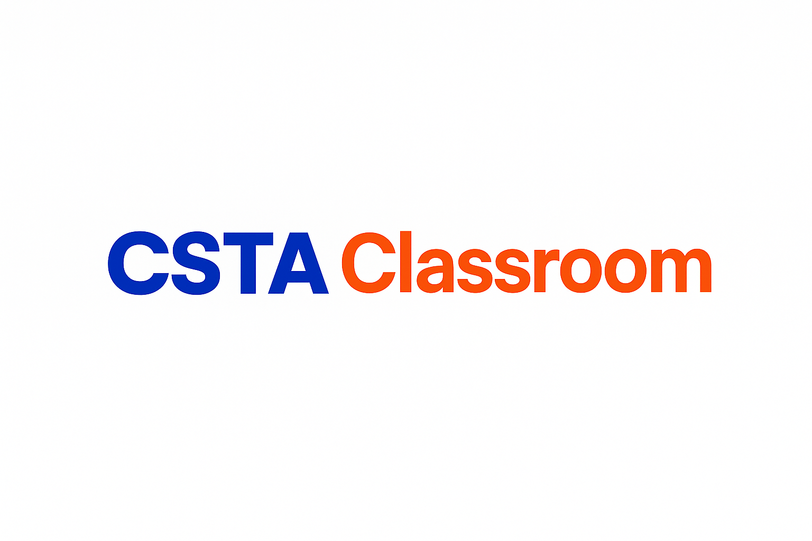

# 📘 CSTA Classroom Series

Welcome to **CSTA Classroom**, a growing collection of hands-on, grade-appropriate computer science lessons aligned with the **CSTA K–12 Computer Science Standards**.

This open resource is designed to support:
- 🎓 Teachers bringing CS to the classroom
- 👨‍👩‍👧 Parents guiding learners at home
- 🧠 Students exploring computational thinking

---

## 📚 Grade Bands Covered

The repository is organized into folders based on **CSTA grade levels**:

| Grade Band | Folder             | Topics Included     |
|------------|--------------------|---------------------|
| K–2        | `K-2/`             | Sequences, Loops    |
| 3–5        | `3-5/` *(coming)*  | Events, Conditionals|
| 6–8        | `6-8/` *(coming)*  | Variables, Functions|
| 9–12       | `9-12/` *(coming)* | Algorithms, Ethics  |

---

## 🛠️ How to Use

Each folder includes:
- ✅ A `README.md` lesson guide
- 🧪 Activity instructions
- 🖨️ Printable PDF worksheets
- 🌐 Links to platforms like [ScratchJr](https://www.scratchjr.org/) and [Code.org](https://code.org/)

To begin, start with:

👉 👉 [K–2: Sequences Lesson](./K-2/01_sequences/README.md)
  
The first module introduces young learners to the concept of **sequences** through storytelling and block-based programming.

---

## 💡 License

This content is licensed under the [MIT License](./LICENSE), so you’re free to reuse or modify it for educational purposes.

---

## ✨ Contribute

Want to contribute a lesson or improve this project? Fork the repo or submit an issue — your ideas are welcome!

---

> Created and maintained by [@cstaclassroom](https://github.com/cstaclassroom)
